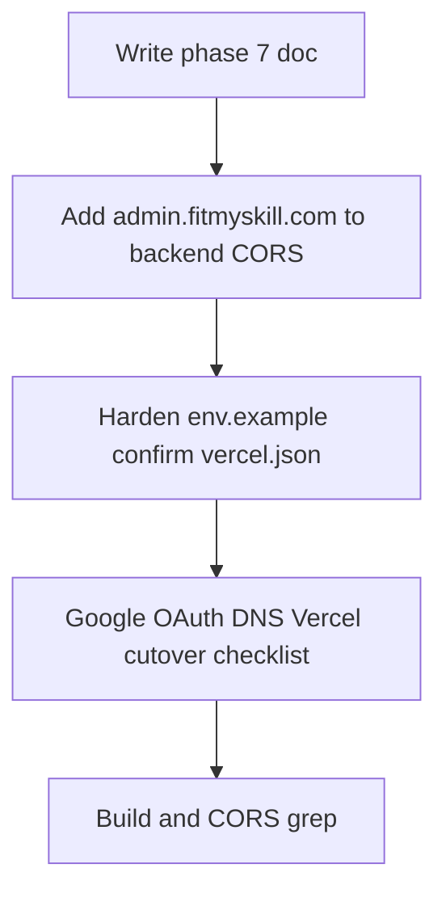

# Phase 7 — Hosting and domain

## Goal

The admin app is served at **https://admin.fitmyskill.com**, talks to `resume-builder-backend`, and authenticates admin users via JWT (email OTP + Google) only — no Clerk, no sign-up.

## Why

CORS and cookies (the `fms_rt` refresh cookie) are origin-bound, and Google sign-in requires the origin to be an authorized JS origin. Recruiter production hosts are already allowlisted. Admin is a new origin. Shipping the cleaned app without this phase leaves sign-in and API calls broken in production.

## In scope

- Deploy the Vite `dist` the same way as other frontends (Vercel is already sketched in `vercel.json`; match whatever recruiter actually uses if that is S3/CloudFront instead).
- DNS: `admin.fitmyskill.com` → that deployment.
- Google OAuth client (the same one used for Google sign-in on this app):
  - Add `http://localhost:8082` and `https://admin.fitmyskill.com` as authorized JavaScript origins.
- Backend CORS on `resume-builder-backend`: allow `http://localhost:8082` and `https://admin.fitmyskill.com`.
- Production env: `VITE_ENV=production`, `VITE_PROD_API_BASE_URL`, `VITE_PROD_GOOGLE_CLIENT_ID`.
- Confirm `vercel.json` SPA rewrite (`/(.*) → /index.html`) still applies.
- Optional: flatten `/admin` to `/` now that the host is admin-only. If you flatten, update AdminLayout hrefs, `admin.routes.ts`, and bookmarks. Default: **keep `/admin` for the first production cutover**.
- Optional: after admin.fitmyskill.com is live, stop linking to admin from recruiter-frontend (separate change in that repo).

## Out of scope

- Moving admin **API** routes off `resume-builder-backend`.
- Deleting admin UI from `recruiter-frontend` (cutover task; do it only after this host is verified so admins are not locked out).

## Cutover note (recruiter-frontend)

Until recruiter-frontend’s `/admin` routes are removed, admins can still open the old panel there. That is acceptable for a short overlap. A follow-up in `recruiter-frontend` should redirect `/admin` → `https://admin.fitmyskill.com/admin` (or the flattened path). Track that outside this repo’s phase 1–6.

## Depends on

Phases 1–6 (the artifact you deploy is already admin-only).

## Success criteria

- `https://admin.fitmyskill.com` loads the admin sign-in.
- Admin user can sign in with OTP or Google and reach the dashboard.
- Recruiter user is denied on this host.
- Authenticated admin API calls (`getAdminMe`, users, recruiters, …) succeed (CORS + bearer token).
- `https://recruiter.fitmyskill.com` is unchanged for recruiters.

## Execution plan

Do these steps in order. **Keep `/admin` prefix** for the first production cutover (do not flatten routes). Do **not** change `recruiter-frontend` in this phase (no redirect yet).

DNS, the Google Cloud Console OAuth client, and Vercel project/env attach require human credentials. This phase completes in-repo readiness + backend CORS, then documents the exact clicks.

### Current state (after phase 6)

- App is admin-only at localhost:8082; `/admin/*` routes kept.
- [vercel.json](../../vercel.json) already has SPA rewrite `/(.*) → /index.html` (same pattern as recruiter).
- Backend CORS in [resume-builder-backend/src/app.ts](../../../resume-builder-backend/src/app.ts) already allows `http://localhost:8082` but **not** `https://admin.fitmyskill.com`.
- Production API used by this app’s local `.env`: `https://api.resumebuilder.fitmyskill.com/api`.
- Git remote exists: `git@github.com:junaifcp/fmj-admin.git`. Vercel CLI is not installed locally.

### Locked defaults

- Keep `/admin` path prefix.
- Add this host's origins to the Google OAuth client used for Google sign-in.
- Deploy via Vercel (match recruiter `vercel.json`).
- Do not remove admin from recruiter-frontend yet.
- Do not commit/push/deploy unless explicitly asked after this phase’s code is ready.

### 1. Backend CORS

In `resume-builder-backend/src/app.ts` `allowedOrigins`, add:

- `https://admin.fitmyskill.com`

Leave `http://localhost:8082` (already present). Redeploy/restart the API after merge so production CORS picks it up.

### 2. Env example for production cutover

Update `fmj-admin/.env.example` production placeholders to the real FitMySkill API host:

- `VITE_PROD_API_BASE_URL=https://api.resumebuilder.fitmyskill.com/api`
- Set `VITE_PROD_GOOGLE_CLIENT_ID` to the production Google OAuth client id in Vercel.
- Document required Vercel env vars: `VITE_ENV=production`, `VITE_PROD_API_BASE_URL`, `VITE_PROD_GOOGLE_CLIENT_ID`.

Do not put secrets into the repo. Do not edit the user’s local `.env` secrets file beyond what already exists.

### 3. Confirm `vercel.json`

No structural change needed if SPA rewrite + Vite `dist` already match recruiter. Confirm and note in the phase doc.

### 4. Manual cutover checklist (Google OAuth + DNS + Vercel)

Document in this file under “Cutover checklist (manual)”:

**Google OAuth client:**

- Authorized JavaScript origins: `http://localhost:8082`, `https://admin.fitmyskill.com`
- Sign-in paths: `/`, `/sign-in`
- After sign-in: `/admin`

**DNS:**

- `admin.fitmyskill.com` → Vercel project for `fmj-admin`

**Vercel:**

- Import `junaifcp/fmj-admin` (or connect existing)
- Set production env vars above
- Attach domain `admin.fitmyskill.com`
- Deploy; verify SPA deep links (`/admin/users`) work

### 5. Verify (in-repo)

- Grep backend for `admin.fitmyskill.com` in CORS list.
- Confirm `vercel.json` rewrite present.
- `npm run build` in `fmj-admin` still passes.
- Full live success criteria (sign-in on admin.fitmyskill.com) depend on completing the manual checklist after backend CORS is deployed.

### Out of this phase

- Flattening `/admin` → `/`.
- Redirecting recruiter-frontend `/admin` → admin.fitmyskill.com.
- Moving admin API off `resume-builder-backend`.
- Automatic Google Cloud Console/DNS clicks (no API access from this session).
- Git commit / `vercel deploy` unless the user asks after review.

## Cutover checklist (manual)

Complete these after the in-repo CORS + env changes land and the API is restarted/redeployed.

### A. Backend

1. Confirm production `resume-builder-backend` includes `https://admin.fitmyskill.com` in `allowedOrigins`.
2. Restart or redeploy the API so the change is live.

### B. Google OAuth client

1. Open the Google Cloud Console project for this app's OAuth client.
2. Add authorized JavaScript origins:
   - `http://localhost:8082`
   - `https://admin.fitmyskill.com`
3. Sign-in URL paths: `/` and `/sign-in`.
4. After-sign-in / force redirect target for this host: `/admin`.
5. Confirm there is no public sign-up on this host — admins are promoted via the Users UI, never self-registered.

### C. Vercel + DNS

1. Create or link a Vercel project to `fmj-admin` (`git@github.com:junaifcp/fmj-admin.git`).
2. Framework: Vite; build `npm run build`; output `dist` (matches `vercel.json`).
3. Production environment variables:
   - `VITE_ENV=production`
   - `VITE_PROD_API_BASE_URL=https://api.resumebuilder.fitmyskill.com/api`
   - `VITE_PROD_GOOGLE_CLIENT_ID=` (production Google OAuth client id)
4. Add domain `admin.fitmyskill.com` in Vercel; point DNS (CNAME/A as Vercel instructs).
5. Deploy and smoke-test:
   - Unsigned `https://admin.fitmyskill.com/` → FitMySkill Admin sign-in
   - Admin signs in (OTP or Google) → `/admin` dashboard
   - Recruiter account → generic sign-in bounce (no role leaked)
   - Deep link `https://admin.fitmyskill.com/admin/users` loads (SPA rewrite)
   - `getAdminMe` / admin APIs succeed (CORS + bearer)

### D. Later (not this phase)

- In `recruiter-frontend`, redirect `/admin` → `https://admin.fitmyskill.com/admin` once the new host is verified.
- Optionally flatten `/admin` → `/` on the admin host only.
